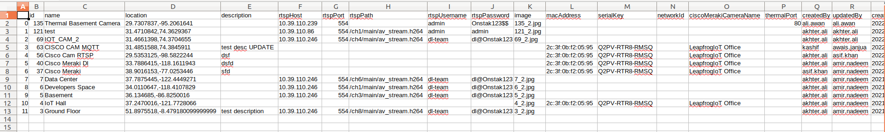

[](https://www.digitalstates.com/)
# Step 1
## Run New Job
First step is to login the tenat by clicking Digitalstates.

[](https://apps.onstak.io/external/va-platform/sso/login)


##### In AI Models,


##### Select Model than click on "+ New" button to add specific camera on the model


##### select camera in Nav-Bar


click next and add Object Type, Count, Name(ROI), draw ROI in Picture and press right click on ROI, add Name by clicking"+"button


than press next button, if notification is required fill it accordingly else press finish button.


In config.json paste the credentials for that Tenat.

Run requirement.txt for creating enviornment, activate it and run the command given below.i.e python run_new_job.py -h is 
for help, python run_new_job.py -m (Name of the model), python run_new_job.py -a(to download all models)
```
## Installation
Install the dependencies by running 
```sh
pip install -r requirment.txt

python run_new_job.py -h

python run_new_job.py -m

python run_new_job.py -a
```
# Step II
## Run Post Job 
```sh
Make sure these two folders preprocessing_videos and final_videos_images (having .json, .jpeg, .mp4 files) and config.json file path in post_job.py with credentials and internet connection than run command given below

python post_job.py

Check the event in final_videos_images than on tenat. 
```
# Step III
## VA Cloud Data
```sh
Run this command 

python get_va_cloud_data.py –h

There is an optional argument naming “-cfg”. This argument take value as name of json file

like “config.json”. The default name is “config.json” in the code. If you have json file 

with some other names like “config_v2.json” or “config_v1.json” you have to pass -cfg 
argument with your spacified name of json file. e.g

python  get_va_cloud_data.py -cfg “config_v2.json”

Note : If your json file name is already “config.json” there is no need to pass -cfg argument
There are two positional argument {camera, model}. To get information about cameras pass camera as argument. To get information about deployed models you have to pass model argument like 

python  get_va_cloud_data.py camera

python  get_va_cloud_data.py model
```
#### Camera
In Camera there are four sub arguments
1. -camera_list
2. -camera_info
3. -rtsp
4. -camera_csv

#### 1. -camera_list
```sh
camera_list shows the list of all cameras names

python  get_va_cloud_data.py camera -camera_list


```
#### 2. -camera_info
```sh
This argument take a value as name of the camera and show complete json of that camera. You pass the argument as 
python  get_va_cloud_data.py camera -camera_info “Developers Space”

Example

{'id': 6, 'name': 'Developers Space', 'location': '34.0110647,-118.4107829', 'description': '', 'rtspHost': '10.39.110.246', 'rtspPort': 554, 'rtspPath': '/ch1/main/av_stream.h264', 'rtspUsername': 'dl-team', 'rtspPassword': 'dl@Onstak123', 'image': '6_2.jpg', 'macAddress': None, 'serialKey': None, 'networkId': None, 'ciscoMerakiCameraName': '', 'thermalPort': None, 'createdBy': 'akhter.ali', 'updatedBy': 'amir.nadeem', 'createdAt': '2021-11-01T15:13:43.000Z', 'updatedAt': '2022-09-26T08:32:45.000Z', 'cameraStreamTypeId': 1, 'cameraRTSPInputTypeId': 1, 'make': None, 'model': None, 'accessMethod': None, 'integrationDetailId': None, 'tenantId': 2, 'DLModels': [], 'integration_detail': None}
```
#### 3. -rtsp
```sh
This argument create rtsp of the camera. You to pass camera name as a value

python  get_va_cloud_data.py camera -rtsp “Developers Space”

```
#### 4. -camera_csv
```sh
This argument will create and save csv of all the cameras available on the tenant.
python get_va_cloud_data.py camera -camera_csv


```
#### Model
```sh
Get model argument help as 

python  get_va_cloud_data.py model --help
```
In model there are three sub argument
1. -model_list
2. -mode_info
3. -model_csv

#### 1. -model_list
```sh
This will list all the deployed models on the tenant

python  get_va_cloud_data.py model -model_list


```
#### 2. -mode_info
```sh
This will take model name as value to display complete json of that model.

python  get_va_cloud_data.py model -model_info “Occupancy”

Example
{'id': 8, 'name': 'Occupancy', 'dlObjects': [{'name': 'Person', 'attributes': [{'key': 'occupancydetected', 'values': ['true', 'false', 'number']}]}], 'description': 'Video analytics occupancy detection', 'image': '1654251858511-792990250.jpg', 'shortDescription': None, 'displayName': 'Occupancy Detection', 'createdAt': '2020-07-01T12:00:00.000Z', 'updatedAt': '2022-06-03T10:24:18.000Z'}
```
#### 3. -model_csv
```sh
This argument will create and save csv of all the models available on the tenant.
python  get_va_cloud_data.py model -model_csv


```
## License

###### ©Digital-States
